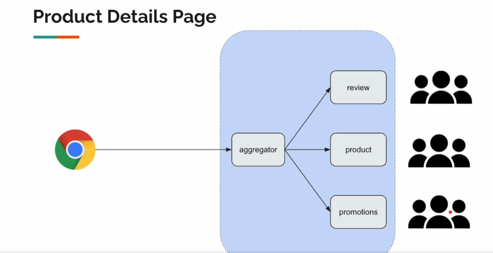

## Aggregator Pattern ##

## 1. О паттерне

Паттерн Агрегатор является одним из паттернов микросервисной архитектуры. В рамках этого паттерна один сервис (агрегатор) отвечает за сбор данных или выполнение действий из нескольких микросервисов, обрабатывает эти данные и возвращает единый результат. Агрегатор выполняет роль посредника, который объединяет результаты от различных сервисов для конечного пользователя или клиента.

## 2. Цель паттерна

Цель паттерна Агрегатор — упростить взаимодействие между несколькими микросервисами и клиентом. Он скрывает сложность интеграции различных сервисов, предоставляя единый интерфейс для взаимодействия с ними. Таким образом, клиенту не нужно обращаться к каждому микросервису по отдельности; вместо этого все необходимые данные поступают через один агрегирующий сервис.

## 3. Преимущества

- **Снижение сложности клиента:** Клиент взаимодействует только с одним агрегирующим сервисом, а не с несколькими микросервисами.
- **Повышенная производительность:** Агрегатор может оптимизировать выполнение запросов к микросервисам, выполняя их параллельно и минимизируя задержки.
- **Гибкость:** Легко изменять состав данных, возвращаемых агрегатором, без необходимости изменять клиентские приложения.
- **Масштабируемость:** Паттерн хорошо масштабируется, так как каждый микросервис может масштабироваться независимо, а агрегатор управляет только запросами.

## 4. Недостатки

- **Центральная точка отказа:** Агрегатор может стать узким местом системы. Если он выходит из строя, это может привести к недоступности всех связанных микросервисов для клиента. Необходимо предусматривать резервирование и отказоустойчивость.

- **Задержки:** Если один из микросервисов, на который полагается агрегатор, работает медленно или выходит из строя, это может задержать или заблокировать ответ всего агрегатора. Нужно реализовывать тайм-ауты и механизмы обработки ошибок.

- **Повышенная сложность:** Хотя агрегатор снижает сложность для клиента, сама реализация агрегатора может быть сложной. Необходимо продумать стратегию обработки ошибок, повторов запросов, балансировки нагрузки и логирования.

- **Увеличение времени отклика:** В ситуациях, когда агрегатор взаимодействует с большим количеством микросервисов, время отклика может увеличиться из-за необходимости выполнения нескольких запросов одновременно.

## 5. Когда использовать

- **Объединение данных:** Когда необходимо собрать и объединить данные из нескольких микросервисов в один ответ.
- **Сложные запросы:** Когда клиентские приложения выполняют сложные запросы к нескольким микросервисам, и существует необходимость скрыть эту сложность.
- **Повышение производительности:** Когда требуется минимизировать количество запросов, отправляемых клиентом, и повысить производительность путем оптимизации взаимодействий между микросервисами.